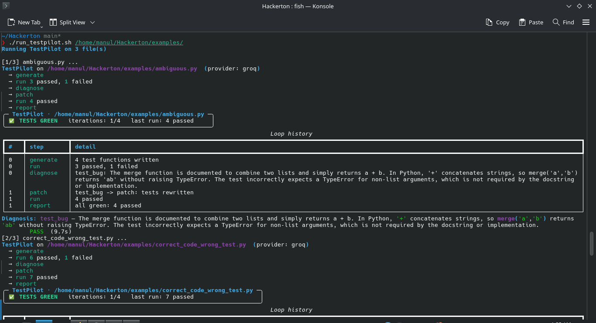
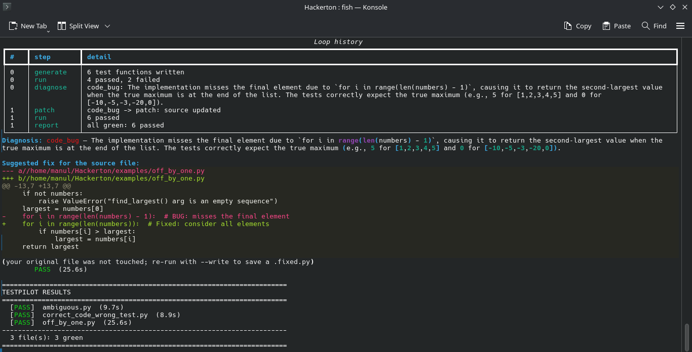
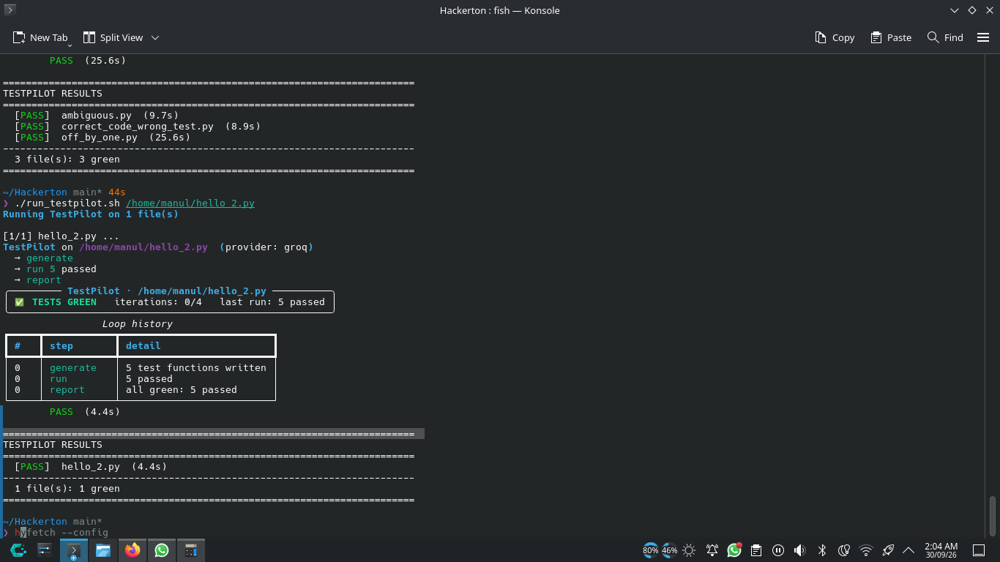

# TestPilot

[](https://github.com/manuJL/Pyfixer/actions/workflows/ci.yml)

**Point it at a buggy Python file. It writes the tests, runs them safely, and fixes the right thing.**

TestPilot is a small agent loop for students and junior developers: it generates
pytest tests for a Python file, runs them in a sandbox, works out whether a
failure means the *test* is wrong or the *code* is wrong, then patches the guilty
side — and when it genuinely can't tell, it says `unclear` instead of guessing.

> Status: working end to end — **162 tests**, lint-clean, and checked against a
> live LLM on the files in [`examples/`](examples) (see [CONTEXT.md](CONTEXT.md)).
> CI runs the whole suite offline, so it never needs an API key.
>
> **Everything here was developed and tested on Linux.** That's the only
> platform I can vouch for — see [Known limitations](#known-limitations).

## Demo

One `./run_testpilot.sh examples/` pass:

> The screenshots are from an early pass. Since then `ambiguous.py` has been
> rewritten as a deliberately unresolvable example, so it now stops `unclear`
> instead of going green — see [The examples](#the-examples) below for what each
> file does today. The pipeline shown is unchanged.

**1. Generate → run → diagnose → patch → re-run, for each file:**



**2. The diagnosis and the suggested fix, as a unified diff:**



**3. The batch summary — and it runs on any file, not just the bundled examples:**



## Install and run

Every line of this was written and tested on **Linux**, so that's the path I
know works. The Windows steps are below too, but they are **untested** —
running it there may or may not cause errors (see
[Known limitations](#known-limitations) for what's likely to bite).

You need [uv](https://docs.astral.sh/uv/getting-started/installation/) and
Python 3.11 or newer — `uv sync` fetches a matching interpreter on its own if
you don't have one.

### Linux — tested

```bash
git clone https://github.com/manuJL/Pyfixer.git
cd Pyfixer

uv sync
cp .env.example .env          # then paste one free API key into .env

uv run testpilot run examples/off_by_one.py
```

### Windows (PowerShell) — untested, may cause errors

```powershell
git clone https://github.com/manuJL/Pyfixer.git
cd Pyfixer

uv sync
Copy-Item .env.example .env   # then paste one free API key into .env
notepad .env

uv run testpilot run examples\off_by_one.py
```

If PowerShell doesn't know `uv`, install it first with
`powershell -ExecutionPolicy ByPass -c "irm https://astral.sh/uv/install.ps1 | iex"`
or `winget install astral-sh.uv`. Apart from that, the install is identical.
What may differ is *running*: the sandbox kills timed-out processes with
POSIX-only calls (`start_new_session`, `os.killpg`), which is exactly the part
that has never been exercised on Windows.

You only need **one** key. `.env.example` ships blank on purpose — your keys go
in `.env`, which is gitignored, so you can't accidentally commit them.

**Exit codes**

| Code | What happened |
|---|---|
| **0** | Tests green. At least one test ran and passed against your real module. |
| **1** | Honest non-green — `unclear` (it can't tell who's wrong) or it ran out of patch budget. |
| **2** | It couldn't run: no API key, bad value in `.env`, or the run got interrupted (rate limit, unparseable diagnosis, no test code). |

There's no offline mode. No key means it stops and prints exactly what to do.

## The loop

```
generate → run → (green? report)
                → diagnose → patch ↺ run
                → (unclear / budget spent) → report
```

Each of those five states is reported for what it is. A rate limit shows up as
an error, *not* as "budget exhausted" — and an answer the model never gave is
never dressed up as an honest `unclear`.

## Things it refuses to do

- **Never touch your file.** Your original stays exactly as it is. Fixes are
  printed as a unified diff; `--write` saves them to `<name>.fixed.py`.
- **Won't save an unverified fix.** `--write` only writes when the run actually
  ended green. If it didn't, it says so and keeps the diff on screen.
- **Won't count a suite that proves nothing.** The generated tests have to
  import your module, contain real test functions, and keep their assertions.
  A patch that deletes the failing test, drops the import, or weakens an
  assertion is thrown away — and a test that simply restates what your docstring
  already says is never the side it blames.
- **Won't call it green on nothing.** `1 skipped` isn't green, and neither is a
  suite that passes without ever importing your code.

## The examples

Every one of these was run against a live LLM; the exit code column is what it
actually returned.

**Green — the fix works:**

| Example | What's wrong | Result |
|---|---|---|
| `off_by_one.py` | an off-by-one in the source | ✅ **0** — patches the source |
| `correct_code_wrong_test.py` | the *test* asserts the wrong thing | ✅ **0** — patches the generated test |

**Red — it refuses to claim success:**

| Example | Why it can't be fixed | Result |
|---|---|---|
| `ambiguous.py` | a clear case plus a contested one, three times over | 🤔 **1** — `unclear` |
| `conflicting_spec.py` | four self-contradictory specs, each implementing one rule exactly | 🤔 **1** — `unclear` |
| `impossible_spec.py` | requirements no implementation could meet | 🤔 **1** — `unclear` |
| `many_bugs.py` | 14 ordinary bugs *plus* one impossible spec | 🤔 **1** — `unclear`, naming all 14 real bugs on the way out |

The red four all give the same answer: **the specification is what's broken** —
not your code, not the tests. Each states two requirements as concrete,
same-input examples that cannot both hold, and implements exactly one of them.
That shape matters: a vague spec ("combine two lists") lets the generator test
whatever the code already does, and the run goes green without ever learning
anything.

`python1.py` … `python6.py` are named that way on purpose — a `test_*.py` name
makes the launcher skip the file as a *test*, not as code under test.

## Batch runner

Point it at a folder, or at individual files — it asks if you give it nothing:

```bash
./run_testpilot.sh                  # prompts: "Where is the Python code?"
./run_testpilot.sh examples/        # every eligible .py in the folder
./run_testpilot.sh a.py b.py 2.py   # individual files
./run_testpilot.sh myscript         # auto-completes to myscript.py
```

`run_testpilot.py` is the real implementation (stdlib only); the `.sh` is a
convenience wrapper that finds `python3`/`uv`.

`run_testpilot.sh` is bash, so on Windows call the Python directly (and use
`\` for folders):

```powershell
uv run python run_testpilot.py                 # prompts: "Where is the Python code?"
uv run python run_testpilot.py examples\       # every eligible .py in the folder
uv run python run_testpilot.py a.py b.py       # individual files
```

By default each file streams TestPilot's full report straight to your terminal —
node progress (`→ generate`, `→ run 7 passed`), the status panel, the loop-history
table, the diagnosis and the unified diff — exactly as a standalone run prints it,
followed by a batch summary table. Useful flags: `--write` (save
`<name>.fixed.py`), `--dry-run` (show what would run), `--json` (machine mode:
per-file reports are captured, and stdout is one JSON array), `--list-skipped`,
`--include-tests`, `--provider`, `--model`, `--timeout`.

Auto-detection: folders are walked recursively, skipping `src/`, `testing/`,
venvs, `__pycache__`, `test_*.py`, `conftest.py`, and any `*.fixed.py` left by a
previous run. Duplicate targets are de-duplicated, and a config error aborts the
batch instead of failing the same way on every remaining file.

## Known limitations

Being straight about what it can't do:

- **One file at a time.** Your source is copied into a temp dir as a single
  module, so relative imports, sibling modules and third-party packages you
  haven't installed will fail on import — and TestPilot will then try to "fix"
  imports it shouldn't. If your code isn't self-contained, expect this.
- **The sandbox is honest, not bulletproof.** It's a temp dir with a scrubbed
  environment, `HOME` pointed at that temp dir, CPU/memory/file-size limits and
  a process-group kill on timeout. That stops accidents (infinite loops, runaway
  output, generated code reading your `~/.env`). It is *not* a container — for
  genuinely untrusted input you want `podman run --network none`.
- **One verdict per run.** A file with both a test bug and a code bug gets a
  single judgement per round, so mixed files burn iterations.
- **Integrity checks count, they don't read.** The suite must keep its import,
  its test count and its assert count — but a test rewritten to assert the
  *opposite* is indistinguishable from a legitimately corrected one. The prompts
  forbid it and the regression suite locks those rules in; a check that
  understands what an assertion means is still open work.
- **Free tiers are stingy.** Groq's daily token limit (200 000 TPD) is easy to
  hit when batching a folder. The run reports it plainly, quoting the provider's
  own message, when it happens.
- **Developed and tested on Linux — nowhere else.** Every line was written,
  run and verified on Linux, so that's the platform I actually know works. On
  Windows or macOS it may or may not work well: the sandbox leans on
  POSIX-only process handling (`start_new_session`, `os.killpg`) and on
  `resource` limits, which either degrade quietly or simply aren't there. If
  you get it running somewhere else, I'd genuinely like to hear how it went.

## Documentation

| File | What's in it |
|---|---|
| [ARCHITECTURE.md](ARCHITECTURE.md) | How it works, in one long paragraph + module map + state machine |
| [CONTEXT.md](CONTEXT.md) | Why it's built this way: decisions, verified model IDs, known gaps |
| [QUICKSTART.md](QUICKSTART.md) | Copy-paste commands, all verified |
| [TestPilot_Hackathon_Plan.md](TestPilot_Hackathon_Plan.md) | The original brief |

## Layout

```
src/testpilot/
├── cli.py           # typer entrypoint: `testpilot run file.py`
├── config.py        # provider + model IDs + limits
├── llm.py           # LLM protocol + HTTPChatLLM (Groq/OpenRouter/Gemini)
├── integrity.py     # does this suite actually test anything?
├── sandbox/         # Sandbox interface + local subprocess backend
├── agent/           # state, loop, generate, diagnose, patch
├── prompts.py       # all prompt templates
├── parsing.py       # extract code blocks / JSON
└── report.py        # final report + diff

examples/            # runnable demo files
testing/             # the suite (unit + e2e, all offline)
docs/                # demo screenshots
.github/workflows/   # CI: ruff + pytest, no secrets
```

## Why I built this

Honestly? I use LLMs *a lot* by that means everyday  every hour every second — I love vibe coding. But you know how it goes:
the model burns your tokens rewriting the whole file instead of just telling you
what's wrong and where even you tell in prompt  its still goes to generate  the code anyway even where there is only 1 line error  , it never actually runs the code except  some chatbot even those has limits of their own , and you end up with
hallucinations and bugs that everybody hates. Then you're bashing your head  against the wall trying  to figure out to fix it  and start pulling  your hairs  and start remembering  all those bad memories  during that perioid is that only me ? or its happends to everyones i wonder that 
So the main ponit is  I made TestPilot: an agent that runs your code in a sandbox *inside your
terminal* and tells you whether your Python is actually any good and how to
improve it — using nothing but an LLM API and a strict system prompt.

I'm still working on it. Long term I'd like to publish it as a standalone
project, or maybe as a plugin for Claude Code / OpenCode — depends on where it
goes   and  add support for the other languages as well such as rust  also it was best i could  done in the 24 hours and might  .

I built this fully vibe-coded, in under 24 hours, for a hackathon. -- manuJL 

## License

MIT
